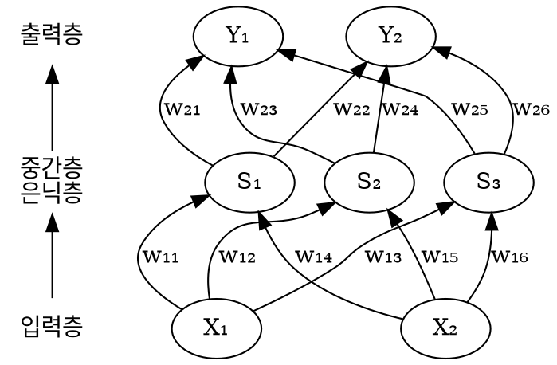
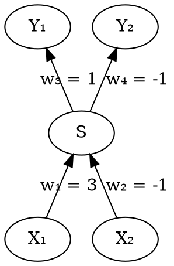
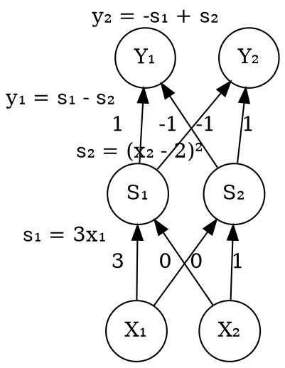
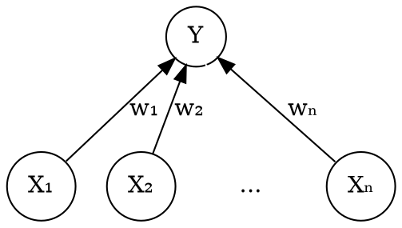

## 인공신경망

### 인공신경망은 유향 그래프 with

* 같은 층끼리는 연결되지 않음
* 위 층으로만 연결
* 한 층 위로만 연결

### 간단한 인공신경망

* S₁의 값 $$ s_1 = f(w_{10} + w_{11} x_1 + w_{14} x_2) $$

### 인공신경망은 다차원 공간에서 패턴분류에 유용.

직선으로 구분되는 분포 예

* 결과 $$ s $$는 입력 벡터 $$ (x_1, x_2) $$와 가중 벡터 $$ (w_1, w_2) $$의 내적과 같다.

    $$
    \begin{aligned}
    s & = w_1 x_1 + w_2 x_2 + w_0 \\
      & = 3 x_1 - x_2 - 2
    \end{aligned}
    $$

* 출력층 Y₁, Y₂와 가중치 w₃, w₄를 추가하면, 결과 $$ s $$를 양수, 음수로 구분할 수 있다.

곡선으로만 구분되는 분포 예

각 node는 아래층의 값의 선형조합에 한차례 비선형 변환을 추가

$$ y = f(w_0 + w_1 x_1 + w_2 x_2 + \cdots + w_n x_n) $$

### 인공신경망 설계

구조의 설계

* 층 수
* 각 층의 노드 수
* 노드끼리의 연결

비선형 함수 $$ f() $$의 설계

* 지수함수를 많이 사용

$$ f(G) = e^G = e^{w_0 + w_1 x_1 + \cdots + w_n x_n} $$

패턴 분류 능력은 최대 엔트로피 모델과 같다.

* 출력 노드에서 얻은 값을 확률분포로 보면, 통계언어모델 등 확률모델과 같아짐.

매개변수($$ w_0, w_1, \cdots, w_n $$)는 학습으로 얻는다.

## 인공신경망 학습

### 지도 학습

* 학습 data
  * 입력: $$ x_i $$
  * 출력: $$ y $$
* 매개변수: $$ w $$
* 모델의 출력값: $$ y(w) $$
* 비용함수 (cost function): $$ C $$

    $$
    \begin{aligned}
    C & = \sum{(y(w) - y)^2} \\
    \hat{w} & = \arg{\min_w{\sum{(y(w) - y)^2}}}
    \end{aligned}
    $$

* 경사하강법등으로 위 함수의 최대값을 찾는다.

### 비지도 학습

학습 data에 입력 data만 있고, 출력 data가 없음.

* 따라서, cost function을 알 수 없음.

하지만,

* 다차원 패턴 분류 문제의 경우에는
  * 한 표본점에서, 학습된 클러스터링 중심(centroid)까지의 유클리드 거리 평균값을 비용함수로 쓸 수 있음.
* 언어모델의 조건부확률 추정의 경우에는
  * 엔트로피를 비용함수로 쓸 수 있음.

## 인공신경망과 베이지안 네트워크의 관계

### 같은 점

* 둘 다 유향그래프
* 마르코프 가정을 따른다.
  * 각 노드는 직전 단계의 노드에 의해서만 결정
* 학습법이 비슷
* 패턴 분류 문제에 대한 효과가 비슷
  * 효율은 다를 수 있음
* 계산량이 방대

### 다른 점

* 구조
  * 인공신경망: 구조가 표준화
    * 그래서 구글이 채택
  * 베이지안: 구조가 유연
* 계산 방식
  * 인공신경망: 변수들의 선형조합 후 비선형 함수 적용
    * 컴퓨터로 구현이 쉽다.
  * 베이지안: 변수에 임의 함수를 적용
    * 유연하지만 복잡
* 전후 관련성 파악
  * 베이지안: 전후 관련성을 고려하기가 쉽다
    * 따라서, 입력된 서열을 풀 수 있다.
    * 음성 $$ \rightarrow $$ 문자 번역, 영어 $$ \rightarrow $$ 중국어 번역
  * 인공신경망: 출력이 독립적
    * 디코더로 사용 불가
    * 주로 확률변수의 매개변수 추정에 사용
    * 음성인식 중 음향학 모델 매개변수 학습에 사용
    * 기계번역 중 언어모델 매개변수 학습에 사용

## 인공신경망이 가능해짐

### 마빈 민스키가 밝혀낸 인공신경망의 문제

규모가 커야 쓸모가 있는데, 그러러면 계산량이 너무 많아진다.

* 입력, 출력층만으로는 XOR을 할 수 없다.
* 복잡한 인공신경망의 학습 계산량은 당시 컴퓨터로 감당 안 됨.

### 인공신경망이 가능해진 이유

1. 기계의 성능 발전
    * 필기 인식
    * 소량의 음성 인식
1. 병렬 처리
    * 구글 브레인은 클라우드 기술 도입

## 구글 브레인

대규모 병렬처리용 인공신경망

### 구글 브레인이 인공신경망을 선택한 이유

* 보편성
  * 다차원 공간에 여러 형상의 패턴 분류 경계선을 그릴 수 있음.
* 한 번 설계로 장기간 사용 가능
  * 인공신경망 알고리즘이 안정적(오래전부터 거의 변하지 않았음)
* 단순하고 병렬 구현이 쉬움
  * 하지만, 맵리듀스와 달리 각 조각의 계산이 완전히 독립적이지 않아서 훨씬 복잡함.

### 구글 브레인의 특징

* 매회 반복시 계산량 줄임
  * 경사하강법을 안쓰고, 확률적 경사하강법 사용
    * 소량의 data를 무작위 추출해서 비용함수를 계산하는 방식
    * 계산량이 크게 줄고
    * 정확성의 조금 희생
  * data의 양이 많아서, 학습 시간을 줄이는게 중요!
* 학습의 반복 회수를 줄임
  * L-BFGS 방법 - limited memory Broyden Fletcher Goldfarb Shanno method
    * 경사하강법보다 수렴이 빠름
    * 원리가 확률적 경사하강법과 유사
    * 최종 목표와의 멀고 가까움으로 반복의 보폭 조절
      * 적은 회수의 반복으로 수렴
      * 한 step의 계산량은 증가
      * 병렬화가 쉽다.
* 모델 매개변수들은 별도 서버에 저장
  * 여러 서버에서 참조하므로

### 구글 브레인 알고리즘

1. 두가지 임무 정의
    * 매개변수를 가져온다.
    * 매개변수를 내보낸다.
1. n대 서버에서 다음을 반복한다.
    1. 매개변수 가져오기. data 가져오기
    1. 비용함수의 경사 계산
    1. 보폭 계산
    1. 새로운 매개변수 계산
    1. 새로운 매개변수 내보내기
